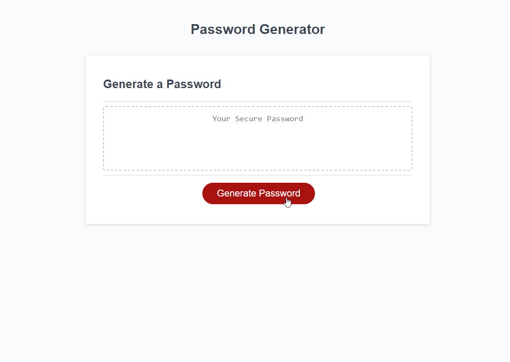

# Password Generator

## Description

The motivation for building this project was to create password generator which could be used to generate a password in a fast, efficient way. By doing this in the browser, it could be accessed by many users and means that creating a secure password is much easier because you can simply press the button and instantly be given a password.

Not only that but because the user is able to choose how long and what type of characters they would like to include, this would allow the password generator to create a password which is customized to their needs. This password generator solves the problem of having to manually come up with a password yourself.

This project helped me understand how to utilise functions in Javascript and also using prompt, alert and confirm in order to allow user input and create errors when for example, the user tries to input a non numerical value into the password character length prompt.

It also helped me understand how to randomly generate a value from an array, and how to utilise multiple functions and call the functions so they can be executed, as well as using for loops in order to iterate through an array of values.
I also understand better the concept of DRY (do not repeat yourself) programming and how this can help to make my code more efficient.

## Installation

N/A

## Usage

In order to use the password generator, simply access the deployed page and click "Generate Password". The site will then prompt the user for their input on how long they want the password to be and what type of characters it will include. Once all the prompts have been successfully completed, a random password will appear in the white box in the middle of the page.

Click to generate password.

Answer prompt with number input.

Answer confirm prompts with okay for yes and cancel for no.

Password is randomly generated based on user specifications.

Console log showing randomly generated characters based on specifications next to "result is".

The deployed page can be accessed at:

https://psychicsalad.github.io/Password-Generator/

If you wish to view the repository for this project, the GitHub repository can be accessed at:

https://github.com/PsychicSalad/Password-Generator

## License

This project uses an MIT license. To find out more, please view the license folder.
